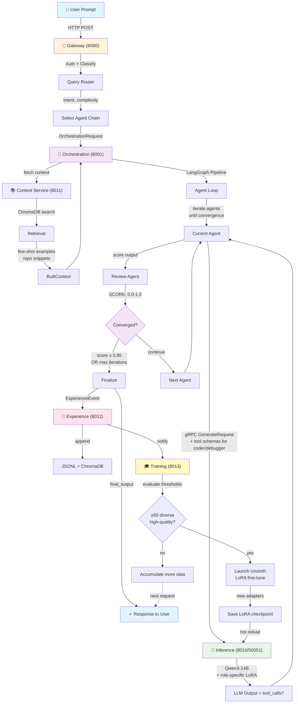

# IdlePods AI Architecture

## System Flow Diagram



## Key Components

### Gateway (8080)
- **Auth**: Validates API key
- **QueryRouter**: Classifies intent (CODING, DEBUGGING, RESEARCH, etc.)
- **Complexity Detection**: SIMPLE → MODERATE → COMPLEX
- **Agent Chain Selection**: Maps (intent, complexity) → ordered agent list

### Orchestration (8001)
- **LangGraph Pipeline**: State machine with convergence scoring
- **Agent Loop**: Iterates through agent_chain until convergence or max_iterations
- **Convergence**: Extracts SCORE from reviewer/critic output, compares against threshold (default 0.85)

### Inference Service (8010 / 50051)
- **Single vLLM Backend**: Qwen/Qwen3-14B serving all agent roles
- **LoRA Adapters**: Six per-capability adapters (`coding_lora`, `debugging_lora`, `review_lora`, `planning_lora`, `research_lora`, `criticism_lora`) loaded on one server
- **Native Tool Calling**: `--enable-auto-tool-choice --tool-call-parser hermes`; tools passed as OpenAI function schemas; thinking mode disabled via `chat_template_kwargs`
- **gRPC Interface**: High-frequency hot path (one call per agent per iteration)

### Training Service (8013)
- **Thresholds** (default):
  - min_batch_size = 50 experiences
  - min_quality_score = 0.65
  - min_score_spread = 0.15 (diversity)
  - min_diversity_ratio = 0.60
- **Subprocess Launch**: Unsloth QLoRA fine-tune on Qwen/Qwen3-14B base
- **Training Format**: ChatML (`<|im_start|>role\ncontent<|im_end|>`); masking boundary `<|im_start|>assistant\n`
- **Tool-Use SFT**: `coder`/`debugger` batches include `tool_turns` (assistant tool-call + tool-result pairs); other roles exclude tool turns
- **Hot Reload**: vLLM picks up new adapters automatically; next request uses improved model

## Data Models

```
OrchestrationRequest:
  prompt: str
  intent: CODING | DEBUGGING | RESEARCH | ANALYSIS | PLANNING | QA | GENERAL
  complexity: SIMPLE | MODERATE | COMPLEX
  agent_chain: List[str]          # e.g., ["planner", "coder", "reviewer"]
  max_iterations: int
  convergence_threshold: float    # default 0.85
  session_id: UUID

OrchestrationResponse:
  session_id: UUID
  output: str                      # final_output from consensus or best_output
  success: bool
  confidence: float                # best_score
  iterations: int
  converged: bool
  agent_steps: List[AgentStep]     # per-iteration contributions
  metadata: dict

AgentState (LangGraph TypedDict):
  user_prompt: str
  agent_chain: List[str]
  agent_chain_index: int
  few_shots: List[dict]            # from ChromaDB (RAG)
  repo_snippets: List[dict]        # from repo scanner
  iteration_history: List[dict]    # per step: role, output, tool_calls?, tool_call_id?
  pending_tool_calls: List[dict]   # OpenAI-format {id, function:{name,arguments}}
  tool_steps_used: int
  tool_originating_role: str
  current_iteration: int
  best_score: float
  best_output: str
  converged: bool
  final_output: str

ExperienceEvent (JSONL record):
  session_id: UUID
  prompt: str
  final_output: str
  agent_chain: List[str]
  contributions: List[AgentContribution]  # role="tool" rows excluded
  final_score: float
  iterations: int
  converged: bool
  intent: str
  complexity: str
  timestamp: ISO8601
  scorer_rule_version: str

AgentContribution:
  role: str
  output: str
  quality_score: float
  iteration: int
  messages: List[dict]            # full ChatML prompt sent to LLM (SFT instruction)
  tool_turns: Optional[List[dict]] # interleaved assistant+tool message dicts for ReAct SFT
```

## Self-Improvement Loop

```
1. RUN       → User submits prompt → agents iterate → response generated
2. RECORD    → ExperienceEvent saved to JSONL + ChromaDB
3. RETRIEVE  → Next similar prompt → Context Service finds this example via RAG
4. TRAIN     → ≥50 diverse high-quality examples accumulated
             → Unsloth launches LoRA fine-tune subprocess
5. DEPLOY    → New adapter saved to /data/lora_checkpoints/
             → vLLM hot-reloads on next request
6. IMPROVE   → Future requests use the fine-tuned adapter automatically
```

## Resilience & Graceful Degradation

| Component | Failure Mode | Behavior |
|-----------|--------------|----------|
| Context Service | Timeout (>2s) or unavailable | Pipeline continues with empty few_shots + repo_snippets |
| ChromaDB | Write fails | JSONL append succeeds; embedding upsert silently fails |
| ChromaDB | Read fails | RAG returns empty list; pipeline continues |
| Inference (vLLM) | Node down | gRPC connection refused; Orchestration returns 503 |
| Training | Concurrent job in progress | Returns "already training" without launching new subprocess |
| Streaming | Client disconnect mid-stream | Token queue cleaned up in finally block |

## Critical Technical Notes

### Tokenizer Pre-Tokenizer Mismatch (DeepSeek)
DeepSeek's `tokenizer.json` declares `Metaspace(replacement="▁")` but its BPE vocabulary uses GPT-2 byte-level encoding (`Ġ` for space). This causes silent space stripping in adapters trained without the fix. **Always applied at training time** in `training/training/lora_trainer.py`:

```python
from tokenizers.pre_tokenizers import ByteLevel
tokenizer.backend_tokenizer.pre_tokenizer = ByteLevel(add_prefix_space=False)
```

After training, save tokenizer directly from backend (not via Unsloth) to preserve the fix.
