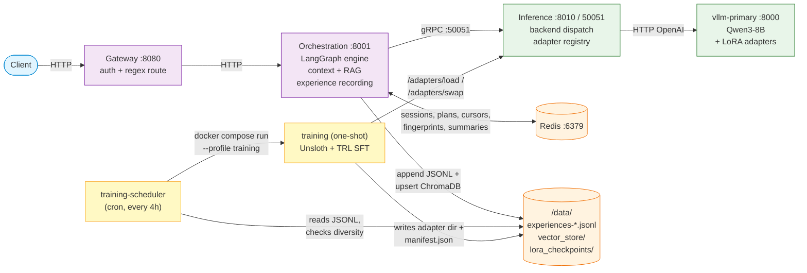
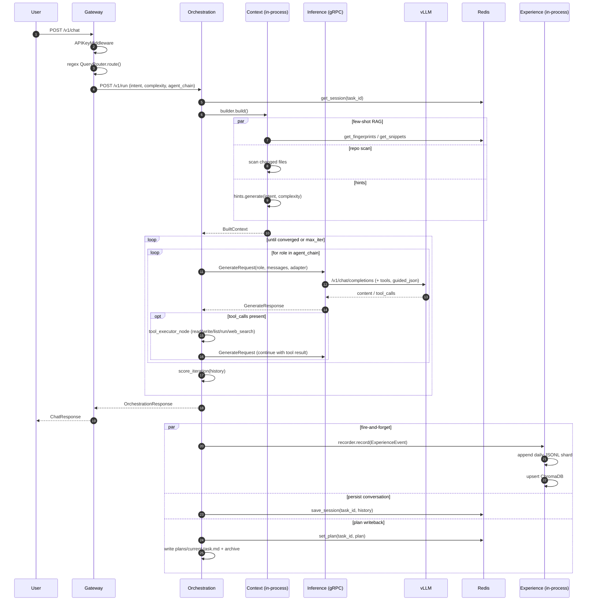
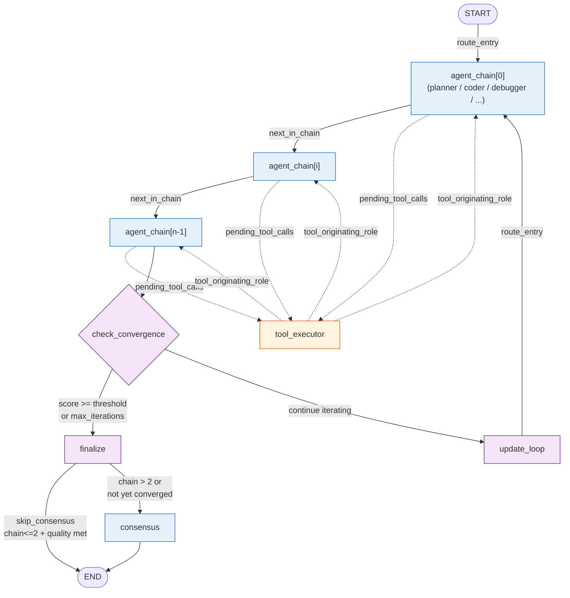
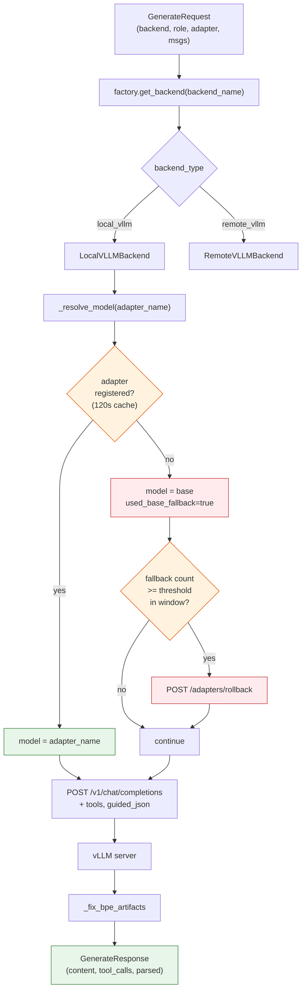
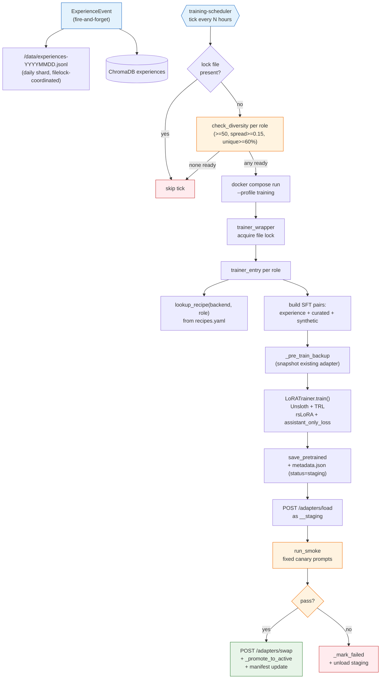
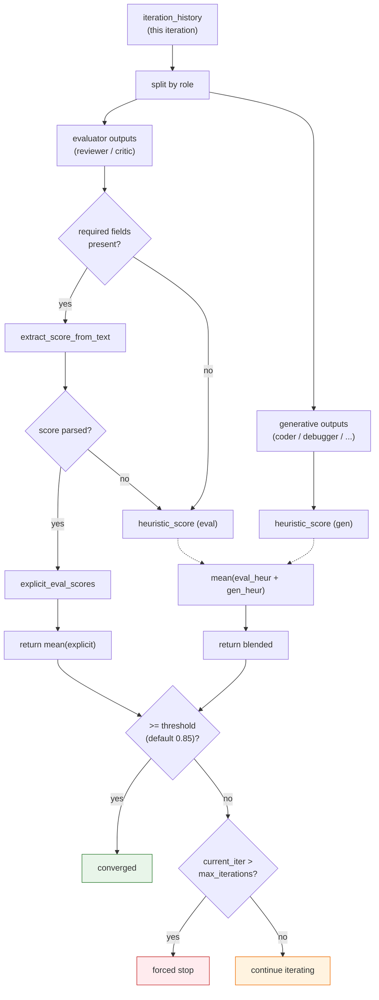
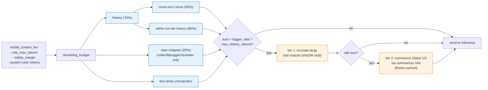

# IdlePods AI — Architecture

This document describes the *current* runtime topology, the data and control flow inside the orchestration pipeline, and the contracts between services. It is grounded in the code and meant to be read top-to-bottom by an engineer who has never touched the repo.

---

## 1. Topology



Two shared volumes carry state across services: `experiences:/data` (JSONL shards, ChromaDB persistent dir, training cursors / heartbeat) and `lora_checkpoints:/data/lora_checkpoints` (adapter dirs + `manifest.json`).

---

## 2. Request lifecycle

### 2.1 End-to-end flow



### 2.2 LangGraph pipeline

The pipeline has two dispatch modes, selected by `ORCHESTRATION__PIPELINE_USE_SUPERVISOR`.

#### 2.2a Legacy mode (default, `PIPELINE_USE_SUPERVISOR=false`)

Agents are visited in the static order of `agent_chain`, advancing a chain index on each turn.



#### 2.2b Supervisor mode (`PIPELINE_USE_SUPERVISOR=true`)

A `supervisor` node runs before every agent turn and applies a priority-ordered rule set to decide which node to visit next.  Every worker and `tool_executor` return to the supervisor after completing, forming a ring topology.  `consensus` is never dispatched directly by the supervisor — it is reached only via `finalize`.

```mermaid
flowchart TD
    START([START]) --> SUP[supervisor]
    SUP -->|R1: pending_tool_calls| TOOL[tool_executor]
    SUP -->|R1.5: last history = tool result| ORIG["originating role<br/>(coder / debugger / ...)"]
    SUP -->|R2a: in_progress plan step| WORKER["step owner_role"]
    SUP -->|R2b: pending plan step| PL[planner]
    SUP -->|R3: plan all terminal| RC[review_critic]
    SUP -->|R3 after eval| CC{check_convergence}
    SUP -->|R4: no plan, chain[i]| CHAIN["chain[i] role"]
    SUP -->|R5: chain exhausted| RC

    TOOL --> SUP
    ORIG --> SUP
    WORKER --> SUP
    PL --> SUP
    RC --> SUP
    CHAIN --> SUP

    CC -->|converged / max_iter| FIN[finalize]
    CC -->|continue| LOOP[update_loop]
    LOOP --> SUP

    FIN -->|skip_consensus| END([END])
    FIN -->|chain > 2| CON[consensus]
    CON --> END

    classDef agent fill:#e3f2fd,stroke:#1565c0
    classDef helper fill:#f3e5f5,stroke:#6a1b9a
    classDef tool fill:#fff3e0,stroke:#e65100
    classDef sup fill:#e8f5e9,stroke:#2e7d32
    class WORKER,ORIG,PL,RC,CON,CHAIN agent
    class CC,FIN,LOOP helper
    class TOOL tool
    class SUP sup
```

**Supervisor rule priority** (`graph/supervisor.py:DeterministicSupervisor.decide`):

| Rule | Condition | Dispatch |
|------|-----------|----------|
| R1 | `pending_tool_calls` non-empty | `tool_executor` |
| R1.5 | Last `iteration_history` entry has `role == "tool"` | `tool_originating_role` (resume after ReAct) |
| R2a | Plan has an `in_progress` step with a valid `owner_role` | that owner |
| R2b | Plan has a `pending` step | `planner` (advances step to `in_progress`) |
| R3 | All plan steps are `done` / `blocked` | `review_critic`, then `check_convergence` |
| R4 | No plan — use `agent_chain[chain_index]` | that role |
| R5 | Chain exhausted or no chain | `review_critic`, then `check_convergence` |

`consensus` is excluded from the supervisor's routing targets; the graph wires it only after `finalize`.

**Enabling supervisor mode** (default: off, safe to flip per-request):

```bash
# compose.yml orchestration environment — already stubbed, uncomment to enable:
ORCHESTRATION__PIPELINE_USE_SUPERVISOR=true
ORCHESTRATION__PIPELINE_SUPERVISOR_MAX_STEPS=8   # caps plan steps per iteration
```

### 2.3 `_prepare_pipeline_run` (`orchestration/app/routes/run.py`)

1. Resolve `task_id` (falls back to `session_id`); ephemeral plans detected when these are equal.
2. Routing precedence:
   - Caller-supplied `agent_chain` always wins.
   - In `regex` mode, gateway's `intent`/`complexity` are honored as-is.
   - In `llm`/`hybrid` mode, the orchestration router is authoritative; gateway hints are discarded.
3. Context build (`context/builder.py`, `asyncio.gather`):
   - Few-shot RAG: ChromaDB query keyed by `all-MiniLM-L6-v2` embedding. Optional `task_exclude` scope.
   - Repo scan with Redis-cached fingerprints.
   - Static hint blob from `(intent, complexity)`.
4. Conversation history loaded from Redis `session:v2:{task_id}`.
5. Plan loading (Redis `task_state:{task_id}` → markdown `plans/current-task.md`); skipped for ephemeral tasks.
6. Recursion limit computed from `(max_iter × per_iteration_nodes) + buffer`.

### 2.4 LangGraph implementation files

| File | Purpose |
| --- | --- |
| `graph/state.py` | `AgentState` TypedDict — JSON-serialisable, no framework objects. |
| `graph/nodes.py` | One node per role; `_run_agent_node` is the shared core. Builds messages, dispatches inference (blocking or streaming), validates output, extracts structured fields. |
| `graph/edges.py` | `route_entry`, `next_in_chain`, `check_convergence`, `route_after_tool_user`. Used by legacy pipeline only. |
| `graph/supervisor.py` | `DeterministicSupervisor` (rules R1–R5), `supervisor_anchor` node, `supervisor_decide` edge fn. Used by supervisor pipeline only. |
| `graph/pipeline.py` | Builds either legacy or supervisor graph; `_recursion_limit` for both modes. |
| `utils/scoring.py` | `score_iteration`, `score_per_entry`, `validate_output` — pattern-based, no ML. |
| `utils/inference_optimizer.py` | Two orthogonal token-saving levers (role-history filter + structured extraction). |
| `tools/runner.py` | `read_file`, `write_file`, `list_files`, `run_command` (allowlist: pytest/ruff/mypy), `web_search`. Path-traversal + dotfile guards. |
| `context/compaction.py` | Tier-1 tool-output truncation + tier-2 LLM summarization (Redis-cached). |

### 2.5 Inference flow (`inference/app/`)



Adapter lifecycle endpoints (`inference/app/routes/adapters.py`): `POST /adapters/load`, `POST /adapters/unload`, `POST /adapters/swap`, `POST /adapters/rollback`, `GET /adapters`.

### 2.6 Self-improvement loop (training)



Tracking files:

- `training/scheduler/scheduler.py` — cron tick, launches the training profile.
- `training/app/trainer_wrapper.py` — file-lock + per-capability driver.
- `training/app/trainer_entry.py` — SFT pair builder + LoRATrainer caller + smoke-gate orchestrator.
- `training/bootstrap/lora_trainer.py` — Unsloth + TRL training core, versioning helpers (`_pre_train_backup`, `_post_train_stage`, `_promote_to_active`, `_mark_failed`).
- `training/bootstrap/smoke_gate.py` — runs the canary adapter probe.
- `shared/manifest.py` + `shared/contracts/manifest_schema.py` — file-locked v2 manifest writer/reader.

---

## 3. State stores

| Store | Purpose | Key TTL |
| --- | --- | --- |
| Redis `session:v2:{task_id}` | Cross-turn conversation history | `ORCHESTRATION__REDIS_SESSION_TTL_S` (3600s) |
| Redis `task_state:{task_id}` | Current Plan dict | 7d default |
| Redis `fps:v2:{task_id}` | File fingerprint cache | `redis_session_ttl_s` |
| Redis `snippets:v2:{task_id}` | Cached repo snippets | `redis_session_ttl_s` |
| Redis `summary:v1:{hash}:{adapter}` | LLM-summarised oldest-turn rollups | `compaction_retention_days` |
| Redis `cursor:{role}` | Training scheduler position | none (persisted) |
| ChromaDB `experiences` | Few-shot RAG (prompt embeddings) | none |
| `/data/experiences-YYYYMMDD.jsonl` | Append-only experience log | manual prune |
| `/data/experiences.spool.jsonl` | Undrained tasks at shutdown | drained on replay |
| `/data/lora_checkpoints/manifest.json` | v2 schema; per-adapter active/previous + history | none |

---

## 4. Core data contracts

All cross-service models live in `shared/contracts/` and are imported by both consumers. None are redefined per-service.

| File | Models |
| --- | --- |
| `agent_prompts.py` | `AGENT_PROMPTS`, `BOOTSTRAP_CAP_TO_ROLE`, `ROLE_TO_BOOTSTRAP_CAP`, `PLAN_STEP_SYSTEM_TEMPLATE` |
| `inference.py` | `Message`, `ToolDefinition`, `GenerateRequest`, `GenerateResponse` |
| `orchestration.py` | `OrchestrationRequest`, `AgentStep`, `OrchestrationResponse` |
| `experience.py` | `AgentContribution`, `ExperienceEvent`, `SCORER_RULE_VERSION` |
| `evaluator_schemas.py` | `ReviewerOutput`, `CriticOutput`, `EVALUATOR_SCHEMAS` map |
| `routing.py` | `RouteClassification` |
| `models.py` | `BackendEntry`, `ModelsRegistry`, `load_registry`, `get_backend_entry` |
| `training.py` | `AdapterRecipe`, `RecipeRegistry`, `load_recipes`, `lookup_recipe` |
| `manifest_schema.py` | `HistoryEntry`, `AdapterEntry`, `Manifest` (v2) |
| `sft_builder.py` | `build_sft_pair` |

---

## 5. Convergence and scoring



Heuristics:
- `_METADATA_LEAKAGE_RE` detects pipeline JSON keys in agent outputs (heavy penalty 0.10) so contaminated adapters fail convergence.
- Coder/debugger reward code presence + length; capped at 0.75.
- Blocker patterns (`BLOCKERS:`, `CRITICAL ISSUE`, `DOES NOT WORK`) subtract; positive patterns (`LOOKS GOOD`, `WELL STRUCTURED`) add.

`validate_output` runs as a post-generation gate. Failures replace the displayed output with `[VALIDATOR_FAIL:<reasons>]` so downstream agents see a sentinel; the original full output is retained on the history entry for accurate scoring.

---

## 6. Optimizations and gates

### 6.1 Token budget management (`graph/nodes.py:_build_messages`)



### 6.2 Routing modes (`ORCHESTRATION__ROUTER_MODE`)

- `regex` — gateway-supplied classification stands; orchestration only re-runs regex internally for the chain.
- `llm` — every prompt goes through `LLMQueryRouter` (guided-JSON, cached LRU).
- `hybrid` — regex first; only when `confidence < router_confidence_threshold` is the LLM call made.

### 6.3 Inference optimizer (`utils/inference_optimizer.py`)

Two orthogonal levers, each toggleable via env:
- **Role history filter** — each agent only sees prior history entries from semantically dependent roles (e.g. reviewer sees coder/debugger but not planner prose).
- **Structured extraction** — reviewer/critic/debugger have only key fields (`SCORE`, `ISSUES`, `SUGGESTIONS`, …) stored in iteration_history; full prose stays in `last_output` for scoring.

### 6.4 Adapter auto-rollback

`_resolve_model` keeps a per-role sliding window of base-fallback events. After `INFERENCE__ADAPTER_FALLBACK_ROLLBACK_THRESHOLD` events in `INFERENCE__ADAPTER_FALLBACK_WINDOW_SECONDS`, it fires `POST /adapters/rollback`.

### 6.5 Smoke gate (`training/bootstrap/smoke_gate.py`)

A post-training adapter is loaded as `<adapter>__staging` and run through fixed canary prompts before swap. Failure leaves the previous adapter intact and writes `status: "failed"` into manifest history.

---

## 7. Resilience

| Component | Failure mode | Behavior |
| --- | --- | --- |
| Context enrichment | Any exception during build | `BuiltContext()` empty; pipeline continues. |
| Few-shot retrieval | ChromaDB unavailable | Empty list; logged warning. |
| Repo scan | OSError | Skipped per file. |
| Inference (gRPC) | Refused / timeout | `[<role> agent unavailable: …]` sentinel; iteration continues. |
| Redis | Down | `is_healthy()` flips false; response carries `history_volatile=True`; pipeline still runs. |
| Adapter not registered | `_resolve_model` falls back | Base model serves; `used_base_fallback=True` recorded. |
| Training subprocess | Non-zero exit / timeout | Cursor not committed; replay on next tick. |
| SSE client disconnect | Generator exits | `task.cancel()` in `finally` cleans the runner. |

---

## 8. Build & deploy notes

- All services build from the repo root with their service-specific Dockerfile.
- `models.yaml` and `recipes.yaml` are bind-mounted read-only into orchestration, inference, and training containers at `/config/`.
- `training` mounts the host docker socket so the scheduler can launch sibling containers via `docker compose run`.
- Health checks: every FastAPI service exposes `GET /health` returning `{"status": "ok", "service": "<name>"}` plus optional component statuses.
- gRPC stubs (`shared/grpc_stubs/`) are generated from `.proto` via `scripts/generate_protos.py` and committed.

## 9. Adaptive LoRA Rank Policy

  ### Decision

  Each per-role adapter grows its LoRA rank organically as the dataset matures.
  When an adapter saturates at the configured cap and plateau signals confirm
  it has stopped learning, the policy **freezes** it. A frozen adapter continues
  to serve inference but is excluded from further retraining, leaving it ready
  to be merged with the shared base into a standalone per-agent model.

  This route was chosen over the alternative of merging adapters into the shared
  base mid-lifecycle. With multiple agents retraining at uneven cadences,
  merging any one of them back into the shared base would bias that base toward
  the most active role and corrupt the others. Per-adapter caps with eventual
  out-of-band merge to a separate per-agent model preserves the shared base as
  a neutral anchor for every role.

  ### Why r=256 is the cap

  - r=8–16: style/format shifts only.
  - r=32–64: task specialization sweet spot (~80–90% of full-FT quality).
  - r=128: real knowledge injection, useful past ~50K high-quality pairs.
  - **r=256**: ~95% of full-FT quality; the practical 3090 ceiling in bf16.
  - r=512+: returns diminish sharply; merge-to-base is more efficient than
    continuing to grow the adapter at this point.

  `AdapterRecipe.max_r_cap=256` matches `vllm-primary --max-lora-rank 256` in
  `docker/compose.yml`. Raising one requires raising the other.

  ### Lifecycle

  bootstrap (r=YAML default, e.g. 32)
          │
          ▼
  retrain → retrain → retrain   (each round produces an adapter_diff_*.json)
          │
          ▼
  plateau signals fire ─────► auto-promote: r doubles, alpha:r ratio preserved,
          │                    zero-pad warm-start expands prior weights into
          │                    new rank slots (ΔW preserved bit-identically
          │                    at step 0; old slots keep refining, new slots
          │                    fill from zero).
          ▼
  retrain at promoted rank → ... → plateau again → promote again ...
          │
          ▼
  rank reaches max_r_cap (256)
          │
          ▼
  plateau signals fire AT cap ───► auto-freeze: wrapper skips this role on
                                    every future tick. Adapter still serves
                                    inference; ready for operator-driven
                                    merge-to-base into a standalone per-agent
                                    model.

  ### Plateau signals

  All three must fire across a smoothing window of 3 consecutive
  `adapter_diff_*.json` reports for the policy to act:

  1. **Loss reduction per round < 2%** — adapter no longer improves on its
     current capacity.
  2. **Regression delta < 0.005** — new versions barely beat the previous
     active adapter.
  3. **Dataset growth ≥ 1.5×** since the last bump — enough new data has
     accumulated that the current rank cannot absorb it at convergence.

  Same signal set drives both promotion (when below cap) and freeze (at cap).
  After a rank bump, signal #1 naturally blocks freeze for the first 1–2
  rounds at the new rank because comparing r=new vs r=prev shows large loss
  reduction — built-in warm-up period before freeze becomes eligible.

  ### Per-role retrain trigger

  Each role has its own `last_trained_experience_timestamp` cursor written to
  its adapter's `metadata.json` on every successful promotion. The training
  wrapper counts qualifying contributions **since the cursor** per role; a
  role is eligible for this tick only when:

  - `is_frozen(adapter_dir)` is **False**, AND
  - new qualifying experiences ≥ `min_new_experiences_per_role` (default 100).

  High-traffic roles progress independently of quiet ones. Failed retrains
  leave the cursor intact so the next tick retries.

  ### Guards

  | Guard | Purpose |

  | `rank_promotion_cooldown=2` | Two consecutive successful promotions required between rank bumps. Prevents one noisy round
  driving a permanent capacity decision. |
  | `_SMOOTHING_WINDOW=3` | Three consecutive `adapter_diff` reports required before any signal can fire. Filters single-round
  noise. |
  | History-anchored effective rank | `maybe_promote_rank` reads `metadata.history[-1].lora_r` as ground truth. Stale YAML
  defaults passed in by callers cannot trigger double-bumps. |
  | Zero-pad warm-start | Bumping rank from r=N to r=2N expands B with zero columns and A with zero rows. `B_new @ A_new == B_old
  @ A_old` at init, so prior learning is preserved bit-identically. |
  | `base_model_hash` anchoring | Every adapter version records the HuggingFace snapshot commit it trained against. Drift between
  consecutive versions emits a `base_model_drift` warning in history so the merge tool can audit. |
  | `tokenizer_hash` anchoring | SHA-256 of the base tokenizer.json, cross-resolved against the local HF cache. Detects silent
  tokenizer changes that would corrupt the adapter's learned token mappings. |
  | Regression gate | New adapter must match or improve the previous active adapter on a fixed prompt set. Failures mark the run
  failed and leave the old adapter live. |
  | Smoke + base-skill gates | Catastrophic failures (broken recipe, OOM, corrupt save, base skill regression) block promotion
  before swap. |
  | Manifest file-lock | All `manifest.json` mutations go through `write_manifest_locked`. Pre-existing concurrency invariant. |
  | Override file isolation | `recipes.yaml` is read-only intent. Auto-applied state lives in `runtime_recipe_override.json` per
  adapter. Recipe text never mutates. |


  ### Operational notes

  - **Inspect freeze state**: `grep -l '"frozen": true' data/lora_checkpoints/*/runtime_recipe_override.json`
  - **Unfreeze**: set `"frozen": false` in the override file *while keeping `r`/`alpha`*. Deleting the file entirely will fall
  back to YAML rank and cause a shape mismatch against the high-rank saved weights — only do that as part of a clean reset after
  merging the adapter into a per-agent base model.
  - **Raise the cap beyond 256**: update both `AdapterRecipe.max_r_cap` and `vllm-primary --max-lora-rank` in `docker/compose.yml`
   together. At r=512+ on a 3090, expect to need `load_in_4bit=true` in the recipe (QLoRA) to fit.
  - **Backfill legacy adapters**: `python -m training.bootstrap.backfill_hashes --checkpoint-dir data/lora_checkpoints` adds
  `tokenizer_hash` and `base_model_hash` to existing metadata without retraining. `dataset_hash` is marked unrecoverable for
  pre-existing entries (the bootstrap dataset was unlinked at train time).