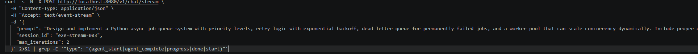
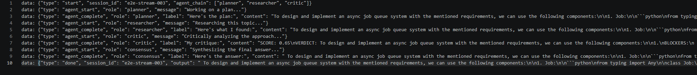

# IdlePods AI

A poor man's local (soon to be fully portable) coding/research assistant designed to be scalable and grow over time.

More formally, this is a self-improving multi-agent LLM tool where a team of specialized agents collaborates to produce a solid response; every successful run feeds into training data that fine-tunes the models over time.

---

## Architecture

```
User submits prompt
    ↓
Gateway → Orchestration (LangGraph pipeline)
    ↓
Pipeline completes (converges or max_iterations)
    ↓
Orchestration publishes ExperienceEvent
    ↓ (fire-and-forget async, doesn't block user response)
Experience Service stores to JSONL + ChromaDB
    ↓
Experience Service notifies Training Service
    ↓ (async background task)
Training Service evaluates thresholds
    ↓ Batch size: ≥ 50 total experiences accumulated (min_batch_size)
    ↓ Score spread: max_score - min_score ≥ 0.15 (ensures diverse quality labels, not all high or all low)
    ↓ Diversity ratio: ≥ 60% of records have unique prompt fingerprints (deduplication guard)
    ↓ Quality filter: Only records with final_score ≥ 0.65 are used (min_quality_score)
    ↓ IF thresholds met, launch LoRA subprocess
Unsloth fine-tunes new adapters
    ↓
Save to /data/lora_checkpoints/
    ↓
vLLM hot-reloads adapters
    ↓
Next request uses improved model
```

---

## Services

| Service | Port | Role |
| --- | --- | --- |
| [gateway](gateway/) | 8080 | Entry point — auth, routing |
| [orchestration](orchestration/) | 8001 | LangGraph agent pipeline |
| [inference](inference/) | 8010 / 50051 | LLM backend — DeepSeek (coding) + Mistral (reasoning) |
| [context](context/) | 8011 | ChromaDB few-shot + repo retrieval |
| [experience](experience/) | 8012 | Persistence — JSONL + ChromaDB + training trigger |
| [training](training/) | 8013 | LoRA fine-tuning via Unsloth |
| [shared](shared/) | — | Pydantic contracts, QueryRouter, gRPC stubs |

Agent roles: `planner researcher coder debugger reviewer critic consensus`  
Intents: `CODING DEBUGGING RESEARCH ANALYSIS PLANNING QA GENERAL`  
Convergence threshold: score ≥ 0.85 (bands: <0.4 poor · 0.4–0.7 acceptable · 0.7–0.85 good)

---

## Quick start

Requires NVIDIA GPU + CUDA drivers and Docker Compose.

```bash
cp .env.example .env
docker compose -f docker/compose.yml up
```

All services expose `/health`. The system is ready when Docker Compose reports all containers healthy.

```bash
curl -X POST http://localhost:8080/v1/chat \
  -H "Content-Type: application/json" \
  -d '{"prompt": "Write a Python function that debounces a callback"}'
```

If running services outside Docker, generate gRPC stubs first:

```bash
python scripts/generate_protos.py
```

---

## Demo





---

## Adapter training notes

**DeepSeek tokenizer:** `tokenizer.json` declares `Metaspace` but the BPE vocab uses GPT-2 byte-level (`Ġ`). Without the fix below, adapters learn to generate spaceless output. Apply immediately after Unsloth loads the tokenizer:

```python
from tokenizers.pre_tokenizers import ByteLevel
tokenizer.backend_tokenizer.pre_tokenizer = ByteLevel(add_prefix_space=False)
```

This is already applied in `training/training/lora_trainer.py`. After training, write only `tokenizer.json` directly from the backend tokenizer — do **not** let Unsloth write `tokenizer_config.json` (causes mojibake that makes vLLM reject the adapter).

All DeepSeek adapters trained before April 2026 (`debugging_lora`, `review_lora`) were trained with the broken pre-tokenizer and need retraining.

---

## Architecture decisions

**Separate vLLM servers for DeepSeek and Mistral** — complementary strengths (code generation vs. reasoning), independent GPU memory allocation. Trade-off: agent communication is token-level, so long chains re-tokenize the full history each hop.

**gRPC for Orchestration → Inference, HTTP elsewhere** — the orchestration-to-inference call is the hot path (one call per agent node per iteration). Everything else is low-frequency enough that HTTP simplicity wins.

**Fire-and-forget for experience recording and training notification** — decouples the user-facing response time from downstream storage and training evaluation latency.

## Limitations

Local inference requires a GPU (min 3090 or better for standard to optimal performance). No CPU fallback path.

Limited to domain specific tasks (using LoRA mainly for Coding, Critic, Debugger, Researcher). Need to consider alternatives like rsLoRA in the future for better stability.

Limited to local inference for full self training pipeline but scalable for self hosted vllm servers to serve baseline models.

Currently one-shot query engine

## Roadmap

Possibly merge current adapter to baseline and use rsLoRA.

Implement mult-turn conversation with persistence layer with Redis or local vector db.

Pre-seed experience dataset with synthetic data for useful few-shot context from day one.

---
